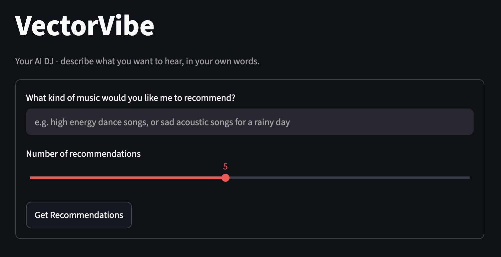

# \<VectorVibe\> - *Your AI DJ!*
VecotrVibe is a full rework/refactor of the CodePath Music Recommender project from module 3 of AI110 Foundation of AI Engineering



## Music Recommender - AI110 Project 3
The original version of this project was CLI only. Its goal was to weigh song data from a 20 song made-up dataset against userProfiles to give recommendation through scoring and ranking rules using the close rankings as reasoning to help the user understand the recommendations.

[View my original submission on github!](https://github.com/K3V1N32/ai110-module3show-musicrecommendersimulation-starter)

## What is VectorVibe and how is it different from the previous project?
The main idea behind VectorVibe is to use streamlit UI, real song data, semantic search, and Retrieval Augmented Generation(RAG) with Gemini AI to massively updrade the useability and functionality of the music recommender.

**Major Changes**
<br />| Original -> New version |
- Role based scoring -> Embedding and semantic search
- Pre-defined User Profiles -> Simple search for music based on text/vibe
- CLI -> Streamlit UI with cover art and song preview
- 20 made up song dataset -> 2,500 real songs from a 500,000 song dataset
- static dataset -> Embedded song metadata with lyric snippets

## Architecture Overview
[UML/Mermaid Diagram](/diagrams/architecture_github.md)

VectorVibe runs in two phases. **Offline (run once):** `scripts/prepare_dataset.py` filters and samples the raw 500k+ song dataset down to a genre-balanced 2,500-song working set, and `scripts/build_embeddings.py` converts each song's genre, mood, energy/danceability/valence, and a lyric snippet into a vector using a local embedding model, caching the result to disk so it never needs to re-run.

**At query time**, the user's free-text query (via the Streamlit UI or the CLI) is embedded the same way and compared against the cached vectors with cosine similarity, surfacing the ~20 closest songs. Those candidates -- not the full dataset -- are handed to Gemini, which picks the best matches and explains why each one fits. A guardrail then drops any pick Gemini returns that isn't actually in that candidate set, so a hallucinated song can never reach the user, and if the Gemini call fails outright, the system falls back to the raw similarity ranking instead of breaking. This retrieve-then-generate structure is what makes the system a genuine RAG pipeline: Gemini only ever explains songs that were actually retrieved, never ones it invents. Finally, Deezer's public API supplies each recommended song's cover art and 30-second preview before everything is displayed.

## Setup

### 1. Python

Requires Python 3.10+ (built and tested on 3.13). Create and activate a virtual environment from the repo root:

```Bash
python3 -m venv .venv
source .venv/bin/activate   # Windows: .venv\Scripts\activate
```

### 2. Install dependencies

```Bash
pip install -r requirements.txt
```

### 3. Gemini API key

1. Create a free API key at [aistudio.google.com/apikey](https://aistudio.google.com/apikey).
2. Create a `.env` file in the repo root (already gitignored -- never commit this) with:

```
GEMINI_API_KEY=your_key_here
```

### 4. Download the dataset

The raw dataset (~1.1GB, not committed to this repo since it contains copyrighted lyrics) is the ["500K+ Spotify Songs with Lyrics, Emotions & More"](https://www.kaggle.com/datasets/devdope/900k-spotify) dataset from Kaggle.

Download it and place the CSV at exactly:

```
data/spotify_dataset.csv
```

### 5. First-time build (run once, from the repo root)

```Bash
python3 scripts/prepare_dataset.py   # ~5 sec -- filters/samples down to data/songs_working.csv (2,500 songs)
python3 scripts/build_embeddings.py  # ~30-60 sec -- embeds all 2,500 songs to data/embeddings_cache.npz
```

The first run of `build_embeddings.py` downloads the local embedding model (`all-MiniLM-L6-v2`) from Hugging Face -- this needs network access once. You may see a `Warning: You are sending unauthenticated requests to the HF Hub` message; that's expected and harmless, not an error (no Hugging Face account is required).

Both scripts are safe to re-run: `prepare_dataset.py` deterministically regenerates the same 2,500-song sample every time (~5 sec), and `build_embeddings.py` skips any song that's already cached, so re-running it after an interruption resumes instead of starting over.

### 6. Run it

```Bash
streamlit run src/app.py   # web UI
# or
python3 src/main.py        # CLI demo
```


## Sample Interactions
### Here are 3 seperate CLI executions of VectorVibe:
Input: Songs for going to the beach
```Bash
Welcome to the VectorVibe command-line demo!
What kind of music would you like me to recommend? Songs for going to the beach
Loaded 2500 songs.
Searching and asking your AI DJ...
Embedding cache is up to date (2500 songs).
Warning: You are sending unauthenticated requests to the HF Hub. Please set a HF_TOKEN to enable higher rate limits and faster downloads.
Loading weights: 100%|█████████████████████████████████| 103/103 [00:00<00:00, 10277.47it/s]

Recommendations for: "Songs for going to the beach"

SURFIN' SAFARI - Ramones  [AI DJ (Gemini)]
  This song fits a beach theme perfectly with its title 'SURFIN' SAFARI' and high valence of 0.90 conveying pure joy.
  Genre: pop punk,punk,punk rock | Mood: joy | Popularity: 75

Plastic Beach - Gorillaz  [AI DJ (Gemini)]
  With the title 'Plastic Beach', it is directly relevant to a beach setting while offering a high danceability of 0.69.
  Genre: trip-hop,rock,electronic | Mood: anger | Popularity: 78

NCT 127 -  Road Trip English Translation - NewJeans  [AI DJ (Gemini)]
  This upbeat track is ideal for a beach trip, featuring a high danceability of 0.80 and great energy of 0.77.
  Genre: k-pop | Mood: joy | Popularity: 80

Stand Tall - Dirty Heads  [AI DJ (Gemini)]
  This track brings a fun beachside vibe with high danceability at 0.71 and a joyful valence of 0.82, plus good for parties.
  Genre: alternative,pop rock,new wave | Mood: sadness | Popularity: 64

Maryland - Elephanz  [AI DJ (Gemini)]
  The cheerful electro-pop vibe matches a sunny beach day with a high valence of 0.83 and high danceability of 0.73.
  Genre: electro,pop | Mood: joy | Popularity: 54
```

Input: Lofi Chill songs for when its thunderstorming
```Bash
Welcome to the VectorVibe command-line demo!
What kind of music would you like me to recommend? Lofi Chill songs for when its thunderstorming
Loaded 2500 songs.
Searching and asking your AI DJ...
Embedding cache is up to date (2500 songs).
Warning: You are sending unauthenticated requests to the HF Hub. Please set a HF_TOKEN to enable higher rate limits and faster downloads.
Loading weights: 100%|█████████████████████████████████| 103/103 [00:00<00:00, 16225.24it/s]

Recommendations for: "Lofi Chill songs for when its thunderstorming"

Winter Winds - Øneheart  [AI DJ (Gemini)]
  Winter Winds by Øneheart is a great chillout and ambient track with very low energy (0.18) and a mood of anger that matches stormy weather, making it ideal for relaxation.
  Genre: chillout,ambient,house | Mood: anger | Popularity: 71

Illusions - Zonyo  [AI DJ (Gemini)]
  Illusions by Zonyo features a lo-fi and chillwave genre combination with low energy and good suitability for relaxation, fitting a cozy thunderstorm vibe.
  Genre: chillwave,hip hop,lo-fi | Mood: joy | Popularity: 51

Spooky Song - Cmd q  [AI DJ (Gemini)]
  Spooky Song by Cmd q has a lo-fi chillwave genre and a mood of fear with low energy (0.27), echoing the dramatic feel of a thunderstorm.
  Genre: chillwave,hip hop,lo-fi | Mood: fear | Popularity: 51

Bad Attitudes - Øneheart  [AI DJ (Gemini)]
  Bad Attitudes by Øneheart shares the chillout and ambient style with very low energy (0.18) and works well for meditation during a heavy storm.
  Genre: chillout,ambient,house | Mood: anger | Popularity: 71

100000 Fireflies - The Magnetic Fields  [AI DJ (Gemini)]
  100000 Fireflies by The Magnetic Fields belongs to the lo-fi genre and features low energy (0.26), providing a calm background appropriate for studying while it storms.
  Genre: lo-fi,indie pop,synthpop | Mood: anger | Popularity: 58
```

Input: Country songs for a square dance
```Bash
Welcome to the VectorVibe command-line demo!
What kind of music would you like me to recommend? Country songs for a square dance
Loaded 2500 songs.
Searching and asking your AI DJ...
Embedding cache is up to date (2500 songs).
Warning: You are sending unauthenticated requests to the HF Hub. Please set a HF_TOKEN to enable higher rate limits and faster downloads.
Loading weights: 100%|█████████████████████████████████| 103/103 [00:00<00:00, 27070.20it/s]

Recommendations for: "Country songs for a square dance"

You Proof - Morgan Wallen  [AI DJ (Gemini)]
  This country song features high energy of 0.84 and strong danceability of 0.73, making it suitable for a square dance.
  Genre: country | Mood: sadness | Popularity: 84

Thinkin Bout You - Morgan Wallen  [AI DJ (Gemini)]
  With a country genre, high energy of 0.76, and good danceability of 0.66, this track works well for party dancing.
  Genre: country | Mood: sadness | Popularity: 85

Reasons The Writers Cut - Luke Combs  [AI DJ (Gemini)]
  This country song is tagged as good for exercise and parties, supported by a high energy of 0.80.
  Genre: country | Mood: sadness | Popularity: 84

Drink U Back - Morgan Wallen  [AI DJ (Gemini)]
  As a country track with a solid energy of 0.70, it fits the genre requirement for a dancing environment.
  Genre: country | Mood: sadness | Popularity: 87

Pimplikeness - Morgan Wallen  [AI DJ (Gemini)]
  Featuring a country genre alongside high energy at 0.84 and danceability of 0.73, it provides a lively rhythm.
  Genre: country | Mood: anger | Popularity: 84
```

## Design Decisions:
The original project was very barebones, used made up data, and I had already had some ideas on making it more user-friendly and how to implement a larger/real song dataset. I originally planned on having the entire 500,000 real song dataset implemented in the semantic search, but upon further research and testing, it was a bit harder to work with such a large dataset in a project of this size. Since the data set is still relatively small as apposed to something like the entire spotify song collection, it's still not going to recommend the best songs for every search, but I believe after testing, that it does at least properly catagorize songs and matches what it has access to pretty well to the search query! So the biggest trade-off I made would be only importing 2,500 of the 500,000 song list, leading to less choices to apply to a given query and also with the time constraints of this project, I was not able to implement more search configuration, such as prefrences like acoustic vs electronic, or other specifics applied to the search.

## Testing Summary:
Initially I tried using a full 500,000 song dataset along with gemini embedding, however I soon found out that free versions of gemini have a quite low request per minute / request per day limit, and also that 500,000 songs is a lot more data than I initially thought. After some tests and questions to Claude, we settled on 2,500 songs spread accross 88 genres to get a decent sample size for embedding, and moved embedding to a local speciallized LLM that can embed the 2500 songs in under a minute. There is also a full pytest suite including testing the AI, the recommender, the embeddings, and even the deezer api interactions. The pytest suites also show off the guardrails put in place, in case Gemini hallucinates a song, the list of actual sent song ids is compared to the list gotten from gemini, and hallucinated songs or extra songs that were not asked for are removed from the list, so the user never sees fake songs.

A run of the Gemini_DJ pytests
```Bash
============================================ test session starts =============================================
platform darwin -- Python 3.13.13, pytest-9.1.1, pluggy-1.6.0 -- /Users/ks3276/projects/CodePath/applied-ai-system-final/.venv/bin/python3.13
cachedir: .pytest_cache
rootdir: /Users/ks3276/projects/CodePath/applied-ai-system-final
configfile: pytest.ini
plugins: anyio-4.14.2
collected 6 items                                                                                            

tests/test_gemini_dj.py::test_get_ai_recommendations_uses_gemini_picks PASSED                          [ 16%]
tests/test_gemini_dj.py::test_get_ai_recommendations_respects_k PASSED                                 [ 33%]
tests/test_gemini_dj.py::test_get_ai_recommendations_falls_back_on_api_error PASSED                    [ 50%]
tests/test_gemini_dj.py::test_get_ai_recommendations_falls_back_when_response_is_malformed PASSED      [ 66%]
tests/test_gemini_dj.py::test_get_ai_recommendations_falls_back_when_picks_reference_unknown_ids PASSED [ 83%]
tests/test_gemini_dj.py::test_get_ai_recommendations_drops_hallucinated_id_without_falling_back PASSED [100%]
```

## Reflection:
This project has taught me a lot about AI, and problem-solving when it comes to large datasets and handling semantic searches! I've learned how to use Retrieval-Augmented-Generation and set guardrails into place to keep users from seeing hallucinated data by augmenting AI with internal data source truths. I've learned about using AI in programming, with Claude helping me write code, and Gemini being the DJ for VectorVibe, I've seen first hand how AI can improve flow and help solve problems that would have been a lot harder to solve on my own!